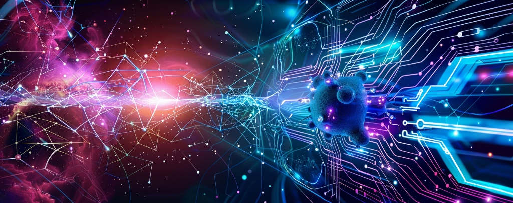

<!-- Optional: Add a visual header -->

### Current Focus / Interests

* 🚀 [Setting up MCP Server locally - link to repo](https://github.com/aaronmeis/learn-mcp-setup)
* 🚀 [Forked and getting running locally to dive in more... - link to repo](https://github.com/aaronmeis/precision-medicine-mcp)

* 🚀 [IBM Quantum Developer Certification - Exploring Qiskit](https://github.com/Qiskit/qiskit)
* 🚀 [PennyLane Quantum Developer Certificate - Photonic Focus](https://github.com/PennyLaneAI/pennylane)
* 💼 [Quantum-AI for Precision Medicine and Materials Science](https://github.com/Qiskit/qiskit-machine-learning)
* 🛠️ [Microsoft Azure Quantum Developer - Hybrid Workflows](https://github.com/microsoft/Quantum)
* 📊 [Quantum Error Correction and Algorithms Learning](https://github.com/qutip/qutip)
